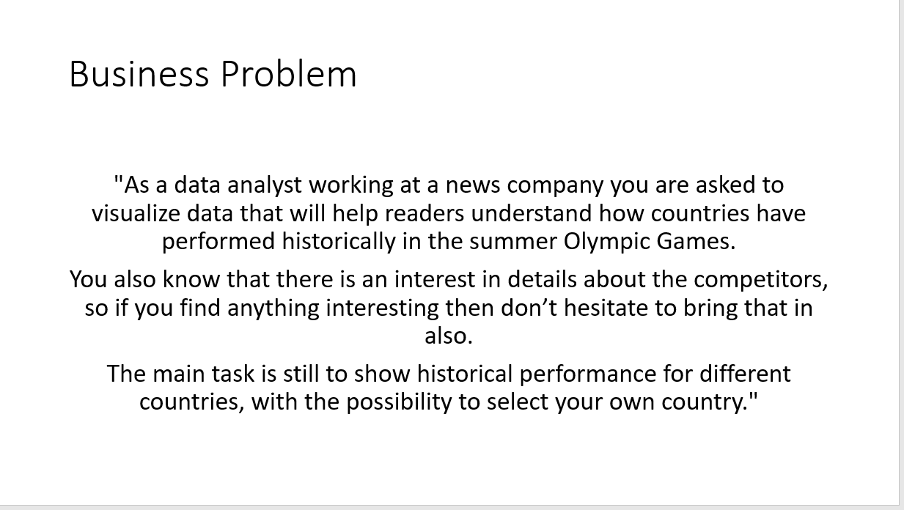
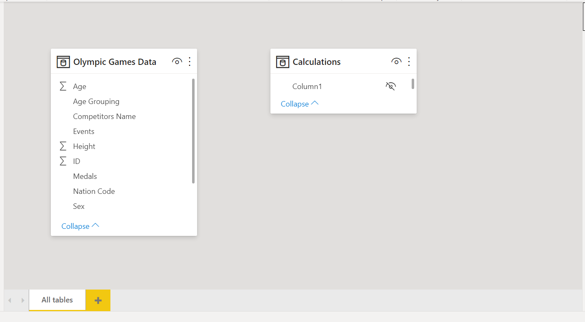
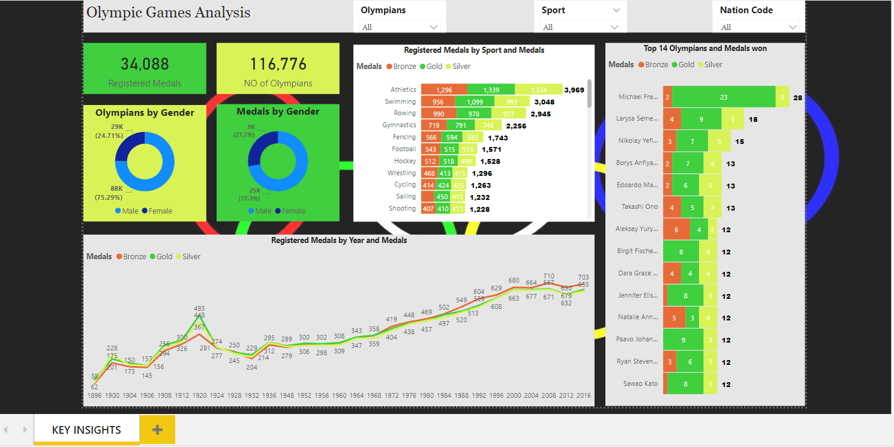

# OlympicsStats
<h2>Business Request & User Stories</h2> 
As a data analyst working at a news company you are asked to visualize data that will help readers understand how countries have performed historically in the summer Olympic Games.
  

 
<h2>Data Cleansing & Transformation SQL</h2>
 
As a data analyst working at a news company you are asked to visualize data that will help readers understand how countries have performed historically in the summer Olympic Games.
One data source provided in Excel format and were connected in the data modeling stage
 
<h2>Data Model</h2>
 
Below is a screenshot of the data model after cleansed and prepared tables were read into Power BI.
 
 

 
<h2>Key Insight Dashboard</h2>
 

 
